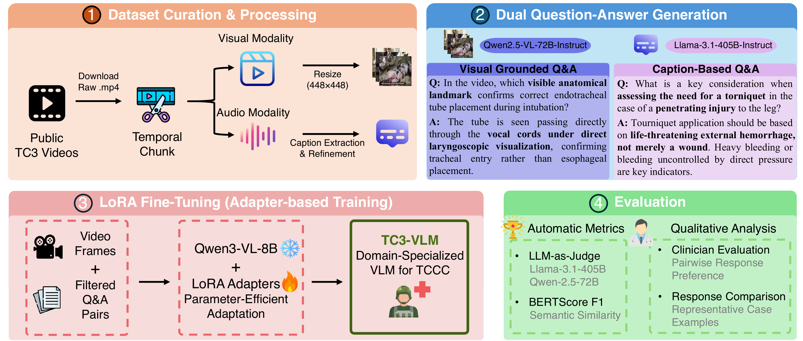

# TC3-VLM: Vision-Language Model for Tactical Combat Casualty Care

A comprehensive pipeline for training vision-language models on Tactical Combat Casualty Care (TC3) training videos. This system automatically generates high-quality question-answer datasets from medical training videos and fine-tunes models using LoRA for domain-specific medical reasoning.

## Overview

This pipeline processes TC3 training videos through multiple stages to create a specialized medical VLM:

1. **Data Collection**: Download YouTube and web videos with metadata
2. **Preprocessing**: Segment long videos into manageable chunks
3. **Caption Extraction**: Extract and refine transcripts using Whisper and LLMs
4. **Dataset Generation**: Create Q/A pairs from both captions and visual content
5. **Dataset Preparation**: Split and format data for training
6. **Training**: Fine-tune vision-language models with LoRA
7. **Evaluation**: Assess model performance with BERTScore, LLM-as-Judge, and clinician evaluation


*Overview of the TC3-VLM framework. (1) Public TC3 videos are temporally chunked, with visual frames and audio transcripts processed separately. (2) A dual Q&A generation pipeline produces visual-grounded pairs (Qwen2.5-VL-72B) and caption-based pairs (Llama-3.1-405B). (3) Filtered Q&A pairs fine-tune Qwen3-VL-8B via LoRA. (4) TC3-VLM is evaluated with BERTScore, LLM-as-Judge, and clinician pairwise evaluation.*

## Key Results

TC3-VLM (Qwen3-VL-8B, visual-grounded, r=16, α=64) achieves the highest LLM-Judge score of **4.584**, surpassing the Qwen2.5-VL-72B baseline (4.360) despite significantly fewer parameters. Fine-tuning consistently improves performance across all model scales.

| Model | Setting | LLM-Judge Overall | BERTScore |
|-------|---------|-------------------|-----------|
| **TC3-VLM** (Qwen3-VL-8B) | Fine-tuned | **4.584** | **0.900** |
| Qwen3-VL-8B | Baseline | 4.027 | 0.857 |
| Qwen2-VL-7B | Fine-tuned | 4.372 | 0.900 |
| Qwen2-VL-7B | Baseline | 3.615 | 0.892 |
| Qwen2-VL-2B | Fine-tuned | 3.655 | 0.893 |
| Qwen2-VL-2B | Baseline | 3.238 | 0.888 |
| Qwen2.5-VL-72B | Baseline | 4.360 | 0.876 |

LLM-Judge criteria (adapted from Med-PaLM 2): Medical Accuracy (M), Protocol Adherence (P), Completeness (C), Actionability (A), Safety (S).

### Ablation: Training Data Composition

Across both model scales, **visual-grounded training consistently outperforms caption-based and combined modes**, indicating that spatial and procedural visual cues are critical for TC3-specific reasoning. LoRA configuration has comparatively modest impact — training data composition contributes more to adaptation quality than rank selection.

### Clinician Evaluation

Two clinicians compared fine-tuned vs. baseline responses on 40 sampled test questions (Qwen2-VL-7B). Both preferred fine-tuned responses in the majority of cases (Clinician A: 52%, Clinician B: 78%). Inter-rater agreement: percent agreement 77.4%, Cohen's κ = 0.52 (moderate reliability). Baseline models were found to incorrectly apply civilian medical standards to TC3 scenarios (e.g., rejecting valid fentanyl administration protocols appropriate in combat settings).

## Dataset Statistics

- **Videos**: 374 (filtered from 476 candidates), ~52.5 hours total
- **Chunks**: 795 segments (mean duration: 292.6 seconds)
- **Q/A pairs (final, after filtering)**: 7,585 total
  - Caption-based: 3,543 pairs (procedural knowledge, TC3 protocols)
  - Visual-grounded: 4,042 pairs (spatial reasoning, equipment recognition)
- **Data split**: 70% train / 15% val / 15% test (video-level)
- **Test set**: 1,201 Q/A pairs from 57 held-out videos

## Project Structure

```
scripts_refactored/
├── data_collection/        # Phase 1: Video downloading
│   ├── download_videos.py
│   └── download_testset.py
├── preprocessing/          # Phase 2: Video segmentation
│   └── segment_videos.py
├── caption/               # Phase 3-4: Caption extraction & refinement
│   ├── extract_captions.py
│   └── refine_captions.py
├── dataset_generation/    # Phase 5-6: Q/A pair generation
│   ├── generate_qa_caption.py
│   ├── generate_qa_visual.py
│   └── filter_qa_llm.py
├── dataset_preparation/   # Phase 6.5-6.6: Data preparation
│   ├── split_dataset.py
│   └── convert_to_finetune_format.py
├── training/             # Phase 7: Model fine-tuning
│   ├── finetune_lora.py
│   └── finetune_lora_qwen3.py
└── evaluation/           # Phase 8: Model evaluation
    ├── evaluate_model.py
    ├── llm_judge.py
    └── compare_large_models.py
```

## Requirements

### Core Dependencies
- Python 3.10+
- PyTorch 2.0+
- transformers (Hugging Face)
- PEFT (for LoRA)
- PyAV / OpenCV (video processing)

### Models Used
- **Transcription**: Whisper large-v3
- **Caption Refinement**: Qwen2-7B-Instruct
- **Caption-based Q/A Generation**: Meta-Llama-3.1-405B-Instruct
- **Visual Q/A Generation**: Qwen2.5-VL-72B-Instruct
- **Q/A Quality Filtering**: Meta-Llama-3.1-405B-Instruct
- **Fine-tuning targets**: Qwen2-VL-2B, Qwen2-VL-7B-Instruct, Qwen3-VL-8B-Instruct
- **LLM Judges (dual)**: Meta-Llama-3.1-405B-Instruct + Qwen2.5-72B-Instruct

### External Tools
- `yt-dlp`: YouTube video downloading
- `ffmpeg`: Video processing

## Installation

```bash
pip install torch transformers peft accelerate
pip install av opencv-python pandas numpy
pip install yt-dlp ffmpeg-python
pip install evaluate bert-score
```

## Pipeline Execution

### Phase 1: Data Collection

Download TC3 training videos from YouTube and educational websites.

```bash
python data_collection/download_videos.py \
    --input videos.csv \
    --output-dir /data/videos \
    --cookies cookies.txt

python data_collection/download_testset.py \
    --input test_videos.csv \
    --output-dir /data/test_videos \
    --cookies cookies.txt
```

**Input**: CSV with columns `[video_id, url, title]`  
**Output**: Downloaded video files with metadata

### Phase 2: Video Preprocessing

Videos exceeding 8 minutes are split into 6-minute segments with 2-minute overlaps to preserve procedural continuity. All frames are resized to 448×448 pixels, aligning with the 28×28 pixel-per-token encoding used in Qwen-VL models.

```bash
python preprocessing/segment_videos.py \
    --video-csv /data/videos.csv \
    --video-dir /data/videos \
    --output /data/chunks.csv \
    --chunk-duration 6 \
    --overlap-duration 2
```

**Output**: CSV with chunk info `[video_file, start_time, end_time, duration]`

### Phase 3: Caption Extraction

Extract captions using platform-provided subtitles when available; otherwise transcribe with Whisper large-v3.

```bash
python caption/extract_captions.py \
    --video-dir /data/videos \
    --output /data/raw_captions.csv \
    --whisper-model large-v3
```

### Phase 4: Caption Refinement

Refine raw captions using Qwen2-7B-Instruct: remove filler words, normalize medical terminology, and produce concise procedural descriptions focused on clinical actions.

```bash
python caption/refine_captions.py \
    --input /data/raw_captions.csv \
    --output /data/refined_captions.csv \
    --model Qwen/Qwen2-7B-Instruct \
    --num-examples 3
```

### Phase 5: Dataset Generation

#### 5.1: Caption-Based Q/A Generation

Generate Q/A pairs from refined captions using Llama-3.1-405B. Prompts encourage diverse reasoning types: procedural sequencing, protocol application, equipment usage, timing, and tactical decision-making.

```bash
python dataset_generation/generate_qa_caption.py \
    --input /data/refined_captions.csv \
    --output /data/qa_caption.csv \
    --model meta-llama/Meta-Llama-3.1-405B-Instruct \
    --num-qa 5 \
    --batch-size 4
```

#### 5.2: Visual Q/A Generation

Generate visual-grounded Q/A pairs from sampled video frames using Qwen2.5-VL-72B. Prompts emphasize questions requiring explicit visual cues: anatomical landmark identification, instrument positioning, hand placement, and spatial verification of procedural execution.

```bash
python dataset_generation/generate_qa_visual.py \
    --input /data/refined_captions.csv \
    --video-dir /data/videos \
    --output /data/qa_visual.csv \
    --model Qwen/Qwen2.5-VL-72B-Instruct \
    --num-qa 5
```

#### 5.3: LLM-Based Quality Filtering

Filter low-quality Q/A pairs using LLM-as-judge. Each pair is scored 1–5 on five criteria: **Factual Correctness**, **Completeness**, **Clinical Relevance**, **Specificity**, and **Safety**. Pairs with an average score below 3 are discarded.

```bash
python dataset_generation/filter_qa_llm.py \
    --caption-qa /data/qa_caption.csv \
    --visual-qa /data/qa_visual.csv \
    --output /data/qa_filtered.csv \
    --judge-model meta-llama/Meta-Llama-3.1-405B-Instruct
```

**Output**: 7,585 high-quality Q/A pairs (3,543 caption-based + 4,042 visual-grounded)

### Phase 6: Dataset Preparation

#### 6.1: Train/Validation/Test Split

Split at **video level** to prevent data leakage.

```bash
python dataset_preparation/split_dataset.py \
    --input /data/qa_filtered.csv \
    --output-dir /data/splits \
    --train-ratio 0.70 \
    --val-ratio 0.15 \
    --test-ratio 0.15 \
    --seed 42
```

#### 6.2: Convert to Fine-tuning Format

```bash
python dataset_preparation/convert_to_finetune_format.py \
    --input /data/splits \
    --video-dir /data/videos \
    --chunks-csv /data/chunks.csv \
    --output-dir /data/finetune
```

**Output**: `train.jsonl`, `val.jsonl`, `test.jsonl`

### Phase 7: Model Fine-tuning

We fine-tune three backbones (Qwen2-VL-2B, Qwen2-VL-7B, Qwen3-VL-8B) with five LoRA configurations. Best overall configuration: `r=16, α=64`, visual-grounded training.

```bash
# Qwen2-VL (2B or 7B)
torchrun --nproc_per_node=4 training/finetune_lora.py \
    --train-data /data/finetune/train.jsonl \
    --val-data /data/finetune/val.jsonl \
    --output-dir ./models/qwen2_lora \
    --base-model Qwen/Qwen2-VL-7B-Instruct \
    --lora-r 16 \
    --lora-alpha 64 \
    --training-mode visual

# Qwen3-VL-8B
torchrun --nproc_per_node=4 training/finetune_lora_qwen3.py \
    --train-data /data/finetune/train.jsonl \
    --val-data /data/finetune/val.jsonl \
    --output-dir ./models/qwen3_lora \
    --base-model Qwen/Qwen3-VL-8B-Instruct \
    --lora-r 16 \
    --lora-alpha 64 \
    --training-mode visual
```

**Training Modes**:
- `visual`: Visual-grounded Q/A only — **recommended; best overall performance**
- `caption`: Caption-based Q/A only (highest protocol knowledge, lower visual performance)
- `both`: Combined dataset

**Output**: LoRA adapter weights

### Phase 8: Evaluation

#### 8.1: BERTScore

```bash
python evaluation/evaluate_model.py \
    --test-file /data/finetune/test.jsonl \
    --base-model Qwen/Qwen2-VL-7B-Instruct \
    --model-paths ./models/qwen2_lora/checkpoint-best \
    --model-names tc3vlm_7b \
    --output-dir ./results \
    --batch-size 4
```

**Output**: `comparison_<model>.csv` (predictions vs. references), `metrics_<model>.json` (BERTScore F1)

#### 8.2: Dual LLM Judge Evaluation

Two independent judges (Llama-3.1-405B and Qwen2.5-72B) evaluate each response. Inter-judge agreement is reported via Pearson r, Spearman ρ, agreement within ±1 point, and MAE to ensure evaluation robustness and reproducibility.

```bash
python evaluation/llm_judge.py \
    --comparison-csvs ./results/comparison_tc3vlm_7b.csv \
    --output-dir ./results/judge \
    --judge-model-1 meta-llama/Meta-Llama-3.1-405B-Instruct \
    --judge-model-2 Qwen/Qwen2.5-72B-Instruct
```

Evaluation criteria (adapted from Med-PaLM 2, TC3-specific): Medical Accuracy, Protocol Adherence, Completeness, Actionability, Safety.

**Output**: Per-criterion scores, overall LLM-Judge scores, inter-judge agreement statistics

#### 8.3: Compare with Large Models

```bash
python evaluation/compare_large_models.py \
    --test-file /data/finetune/test.jsonl \
    --large-model Qwen/Qwen2.5-VL-72B-Instruct \
    --finetuned-csvs ./results/comparison_tc3vlm_7b.csv \
    --finetuned-labels tc3vlm_7b \
    --output-dir ./results/comparison \
    --batch-size 2
```

#### 8.4: Clinician Evaluation

Blinded pairwise preference evaluation on 40 clinician-curated test questions. Evaluators select the clinically superior response or indicate equivalence; question and response order are randomized. Ground-truth tracking is handled via Google Forms with Apps Script automation.

## Key Design Decisions

### Why Dual Q/A Generation?

TC3 scenarios require two complementary types of understanding:

**Caption-based Q/A** captures procedural knowledge conveyed through verbal instruction — protocol steps, drug dosages, equipment selection, tactical decision-making.

**Visual-grounded Q/A** captures what can only be verified by observation — anatomical landmark identification, instrument positioning, hand placement, spatial verification. Caption-based supervision alone cannot teach a model to actually *see*.

Ablation results confirm that **visual-grounded training is essential**: it consistently outperforms caption-based and combined modes across all model scales.

### Why Domain-Specific Fine-Tuning?

General-purpose VLMs default to civilian medical standards in combat settings — for example, rejecting valid TC3 fentanyl protocols based on general medical training. Domain-specific fine-tuning corrects this systematic misalignment.

### Why Dual LLM Judges?

Single LLM judges can exhibit verbosity bias (favoring longer responses regardless of clinical accuracy). Two independent judges (Llama-3.1-405B + Qwen2.5-72B) with inter-judge agreement analysis produce more robust, reproducible evaluation. Our experiments show Pearson r and Spearman ρ exceeding 0.7 in the majority of configurations, with over 75% of scores within ±1 point between judges.

## Configuration

```python
# Training defaults
MAX_FRAMES = 32          # Frames per video chunk
TARGET_SIZE = 448        # Frame resolution (aligns with Qwen-VL 28px/token scheme)
LORA_R = 16             # LoRA rank (best from ablation)
LORA_ALPHA = 64         # LoRA alpha
BATCH_SIZE = 2          # Per-device batch size
LEARNING_RATE = 1e-4    # Initial learning rate
```

## Data Format

### Chunk CSV
```csv
video_file,start_time,end_time,duration,video_id
video_001.mp4,0.0,360.0,360.0,ABC123
video_001.mp4,240.0,600.0,360.0,ABC123
```

### Fine-tuning JSONL
```json
{
  "video": "video_001.mp4",
  "start_time": 0.0,
  "end_time": 360.0,
  "conversations": [
    {"role": "user", "value": "<video>\nHow should a tourniquet be applied?"},
    {"role": "assistant", "value": "The tourniquet should be placed 2-3 inches above the wound..."}
  ],
  "metadata": {
    "source": "visual",
    "march_category": "Massive_hemorrhage"
  }
}
```

## Troubleshooting

**Out of Memory (OOM)**: Reduce `--batch-size`, decrease `MAX_FRAMES`, or enable gradient checkpointing (on by default).

**Video Decoding Failures**: Update `ffmpeg` and `yt-dlp`. PyAV automatically falls back to OpenCV for problematic codecs (AV1/VP9). Use `--apptainer` flag in containerized environments.

**Low Inter-Judge Agreement**: Check for verbosity bias. Ensure judge prompts explicitly instruct focus on clinical accuracy rather than response length.

## Citation

```bibtex
@inproceedings{tc3vlm2026,
  title={{TC3-VLM}: Vision-Language Model for Tactical Combat Casualty Care},
  author={Anonymized Authors},
  booktitle={Medical Image Computing and Computer Assisted Intervention (MICCAI)},
  year={2026}
}
```

## Acknowledgments

- TCCC guidelines: Committee on Tactical Combat Casualty Care (CoTCCC)
- Pipeline methodology: adapted from OpenBiomedVid
- Evaluation criteria: adapted from Med-PaLM 2
- Base models: Qwen team (Alibaba DAMO Academy), Meta AI (Llama)
- Video processing: PyAV, OpenCV, yt-dlp communities